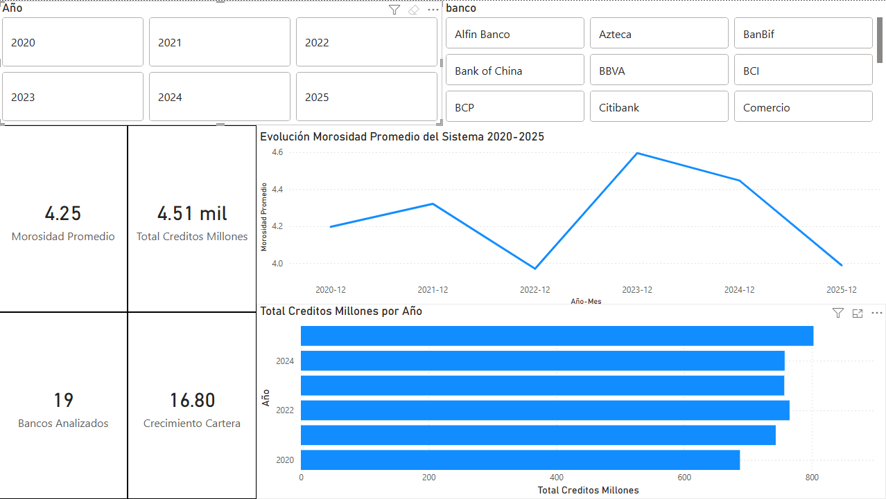
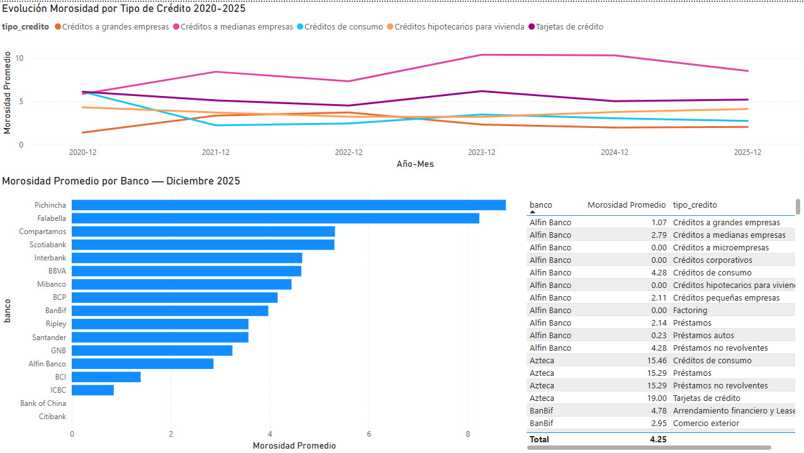
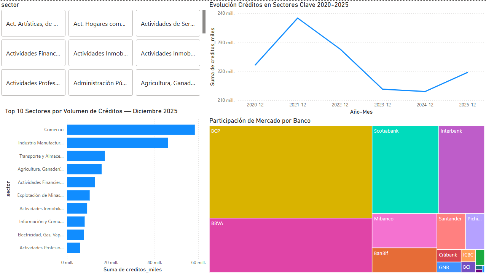

# Análisis del Sistema Financiero Peruano (2020-2025)

Análisis exploratorio de datos públicos de la Superintendencia de Banca, Seguros y AFP (SBS) sobre la Banca Múltiple peruana, abarcando 19 instituciones financieras en el período 2020-2025.

---

## Problema que resuelve

La información pública de la SBS se publica en archivos Excel individuales por mes y año, sin consolidación histórica. Este proyecto automatiza la extracción, limpieza y análisis de 18 archivos fuente para construir una visión integrada del sistema financiero peruano.

---

## Herramientas utilizadas

| Herramienta | Uso |
|---|---|
| **Python (pandas)** | Extracción, limpieza y consolidación de datos |
| **openpyxl** | Lectura de archivos Excel de la SBS |
| **Jupyter Notebook** | Análisis exploratorio y visualizaciones |
| **matplotlib / seaborn** | Gráficos del EDA |
| **Power BI** | Dashboard interactivo |

---

## Fuente de datos

Superintendencia de Banca, Seguros y AFP (SBS) — Banca Múltiple:
- **B-2362**: Morosidad por tipo de crédito y empresa bancaria
- **B-2359**: Créditos directos por tipo, modalidad y moneda
- **B-2336**: Créditos a actividades empresariales por sector económico

Período: Diciembre 2020 — Diciembre 2025 (datos anuales)

---

## Estructura del proyecto
```
analisis-sbs/
├── data/
│   ├── raw/               ← Archivos originales SBS (.xlsx)
│   └── processed/         ← CSVs consolidados y limpios
├── scripts/
│   └── procesar_sbs.py    ← Pipeline de extracción y limpieza
├── screenshots/
│   ├── dashboard_resumen.png
│   ├── dashboard_morosidad.png
│   └── dashboard_sectores.png
├── analisis_sbs.ipynb     ← Análisis exploratorio y visualizaciones
└── README.md

---

## Hallazgos principales

- La morosidad promedio del sistema bajó de **4.20%** en diciembre 2020 a **3.99%** en diciembre 2025, una mejora de **-0.21 puntos porcentuales**, reflejando la normalización post-COVID del sistema financiero peruano.
- La cartera total de créditos creció **+16.8%** entre 2020 y 2025, alcanzando **S/ 802.8B**, impulsada por la expansión del crédito de consumo e hipotecario.
- **BCP, BBVA e Interbank** concentran aproximadamente el 60% de la cartera total, con una concentración estable durante todo el período analizado.
- El sector **Comercio** lidera en volumen de créditos empresariales, seguido de Industria Manufacturera y Actividades Inmobiliarias.
- Los créditos a **medianas empresas** registran la mayor morosidad del sistema, con un pico en 2023 asociado al vencimiento de reprogramaciones COVID y recuperación progresiva hacia 2025.
- **Pichincha** es el banco con mayor morosidad en diciembre 2025 (6.28%), mientras **BCP** mantiene uno de los ratios más bajos entre los bancos grandes (3.21%).

---

## Cómo ejecutar
```bash
# 1. Clonar el repositorio
git clone https://github.com/SebGarate/Analisis-SBS

# 2. Instalar dependencias
pip install pandas openpyxl matplotlib seaborn jupyter

# 3. Procesar los datos crudos
cd scripts
python procesar_sbs.py

# 4. Abrir el notebook
cd ../notebooks
jupyter notebook analisis_sbs.ipynb
```

---

## Dashboard Power BI

### Resumen del Sistema


Morosidad promedio del sistema en 3.99% a diciembre 2025, cartera total de S/ 802.8B y crecimiento del 16.8% respecto a 2020.

### Análisis de Morosidad por Banco y Tipo de Crédito


Pichincha (6.28%) y Compartamos (5.73%) lideran en morosidad a diciembre 2025. Los créditos a medianas empresas son el segmento más deteriorado del sistema.

### Créditos por Sector Económico


Comercio e Industria Manufacturera concentran el mayor volumen de créditos empresariales con amplia ventaja sobre el resto de sectores.

---

## Nota metodológica

La SBS modificó su clasificación de sectores económicos entre 2020 y 2022, por lo que algunos sectores presentan cambios de nomenclatura en la serie histórica. Los datos de 2020 incluyen el efecto de las medidas de reprogramación crediticia por COVID-19, lo que artificialmente redujo la morosidad reportada en ese período.

---

## Autor

**Sebastian Garate**
Estudiante de Ingeniería de Sistemas — Universidad de Lima (7° ciclo)
[LinkedIn](https://linkedin.com/in/sebastián-gárate-651698317) · [GitHub](https://github.com/SebGarate)
